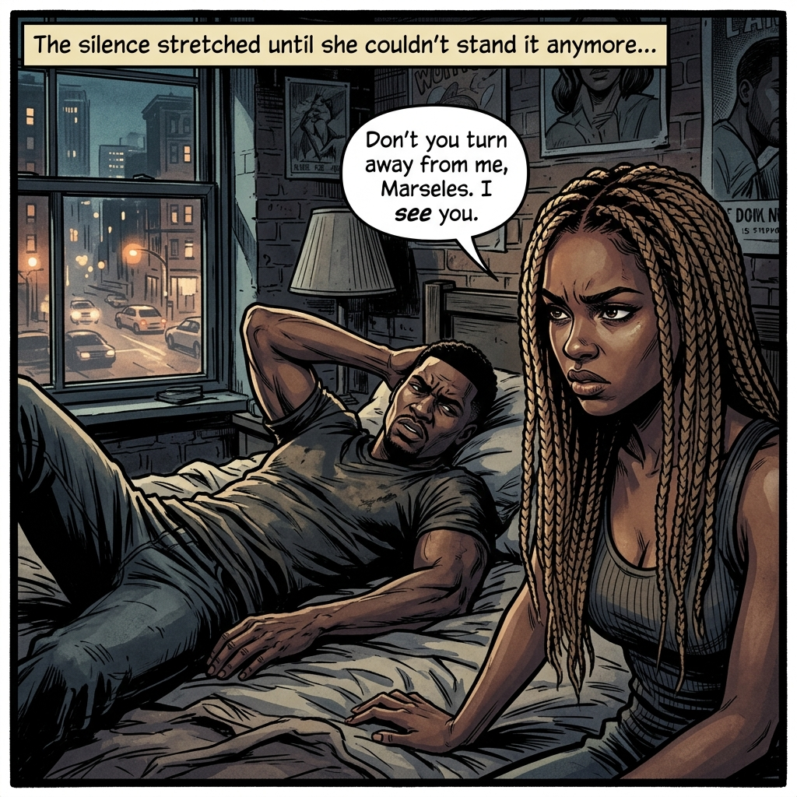
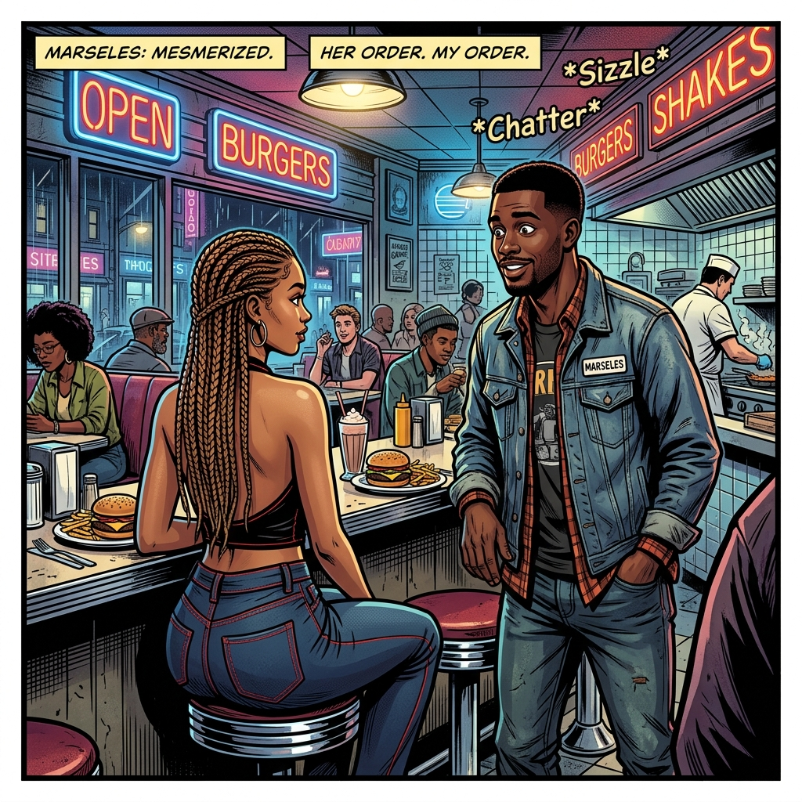
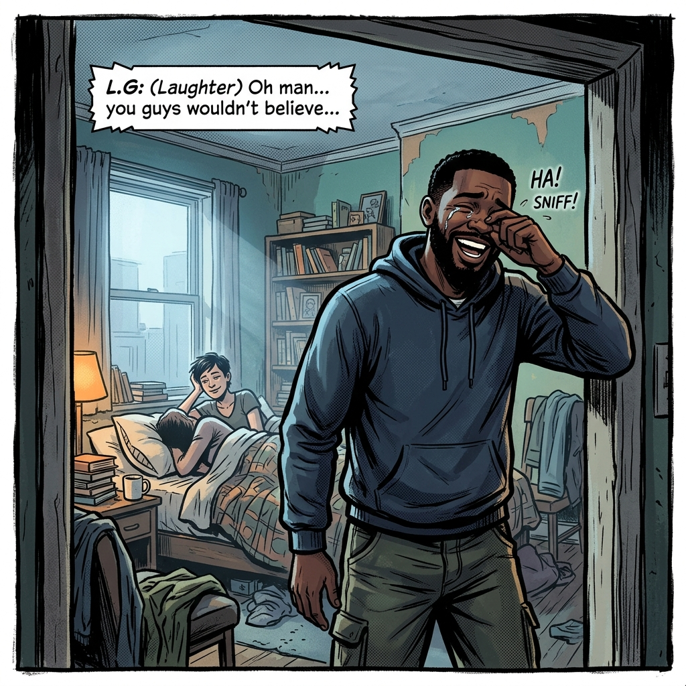

# Episode 1: The Exchange

## Scene 1: Morning Tension

Marseles lay in bed, the tension between him and Babygirl thick enough to cut. She stared at him—eyes locked, unblinking.

"You got eyes," Marseles said. "Buggers."

Marseles tried to be funny. "Ain't nothing funny right now and you know it, so don't even start. I didn't even sleep because of your ass—your stankin' ass—and now you want to try to be funny. I'm telling you now: I wasn't coming to your funeral. I didn't want to come get you. I got to get up and go to work, nigga. You need a job. I'm not going to keep being there whenever you get ready."

Marseles just looked at his Babygirl and let her say what she needed to say to feel better.

"You finished?"

"No, I'm not finished."

She lifted herself up onto one elbow, kicking him to get off the bed. Marseles just smiled—because this was her way of dealing with what hurts, and he knew it. It took him a few months to break down her walls when they first met. She had the potential to be all he needed, but he wasn't really sure yet.

---

## Scene 2: The Diner

When they first met, they both ordered the same thing.

Marseles first noticed her light brown complexion—it looked so creamy. His eyes took in all of her, starting from her shoes. Because you can tell how someone is doing by their shoes. Her echo jeans with the red stitching—he remembered thinking *damn, Echo used a lot of material to cover all that ass she had.* Her light brown braids fell down to the middle of her back. Her backless shirt falling down around her hips.

As she stepped aside to let him order, her light brown eyes demanded attention—and they got all of his. It was as though she didn't even notice him staring.

"Are you going to order, because I'm not on the menu?"

Babygirl pushed him, snapping him back to the present. "You're not even listening."

Marseles grabbed her, pulling her close, kissing her—smelling her morning breath and the smell of her all-natural.

"This ain't over. Don't even try."

Pushing him back but keeping him close enough to keep both hands on his chest.

"I know you were worried when my boy called you, but you got to know I've got to get my paper."

"Why don't you do something else to get your paper?" She rolled her neck like only a black woman could. "You know you're so smart, you're stupid sometimes."

Marseles had heard that more than just a few times.

"I'm going to get it, baby. Don't trip."

"Yeah, you're going to get it. But you may not get it the way you want it."

She rolled out of bed to get ready for work.

"Why don't you let me take care of you?" Babygirl said from the bathroom.

"You are taking care of me." He said, watching his manhood start to rise as he thought of all that ass that just shook walking into the bathroom.

"Not this morning. I've got—" she paused as she peeked out the bathroom seeing the tents that he was making under the towel. "—to go. You're not dying so I've got to go to work. Your crack don't pay my bills."

---

## Scene 3: L.G Shows Up

L.G stood in the doorway, wiping his eyes, laughing—watching his boy get checked by a girl. But he knew it was the love, because his boy was no push over for a woman.

"Put some drawls on, nigga. Mind ya business. This my house and my ass."

Slapping Babygirl on her ass as she walked by. Both him and L.G had to watch.
