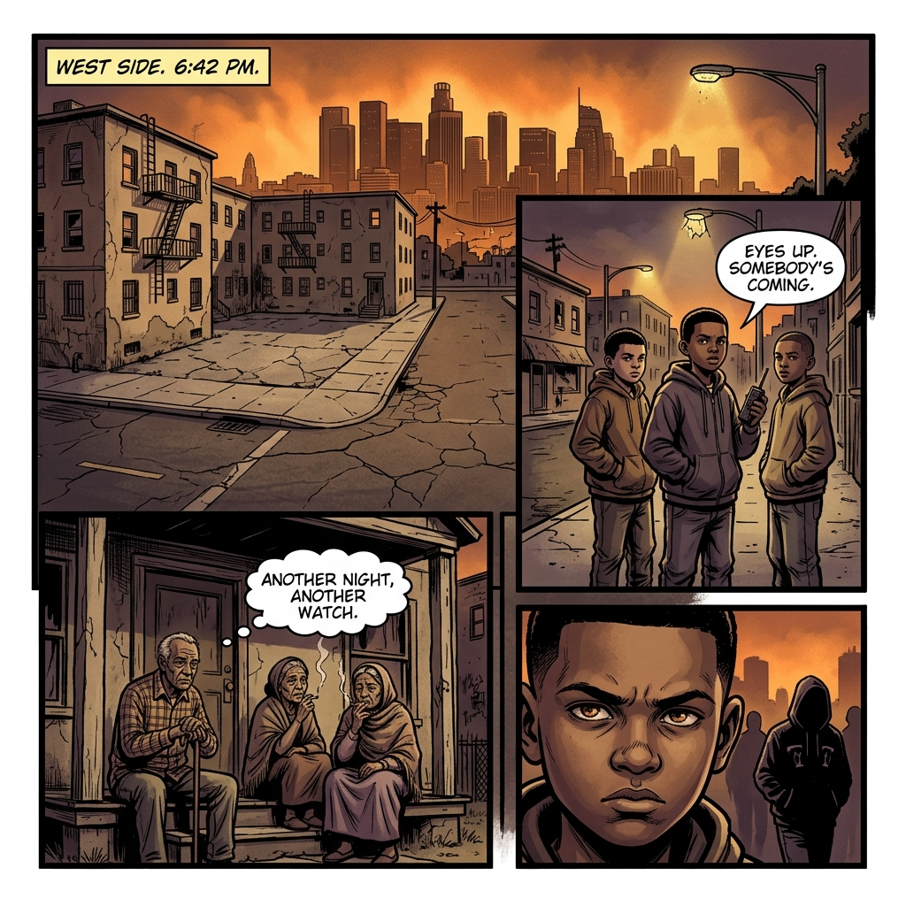
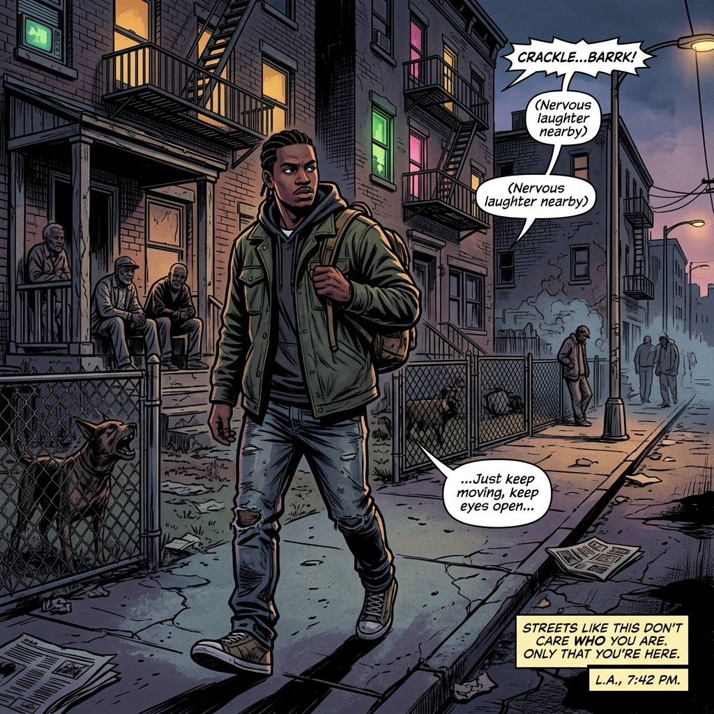
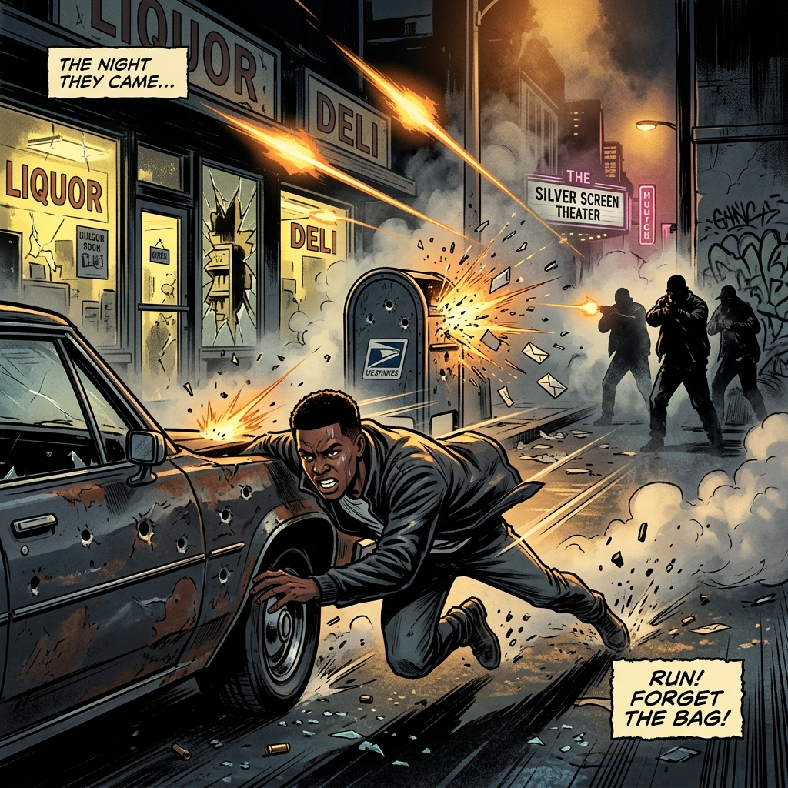
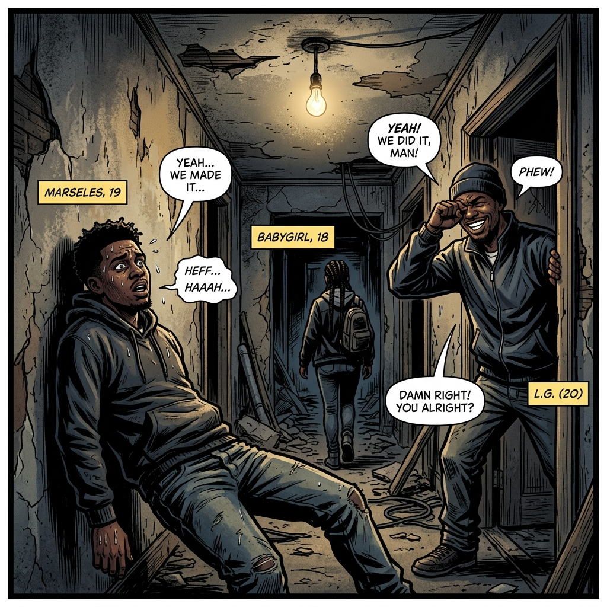
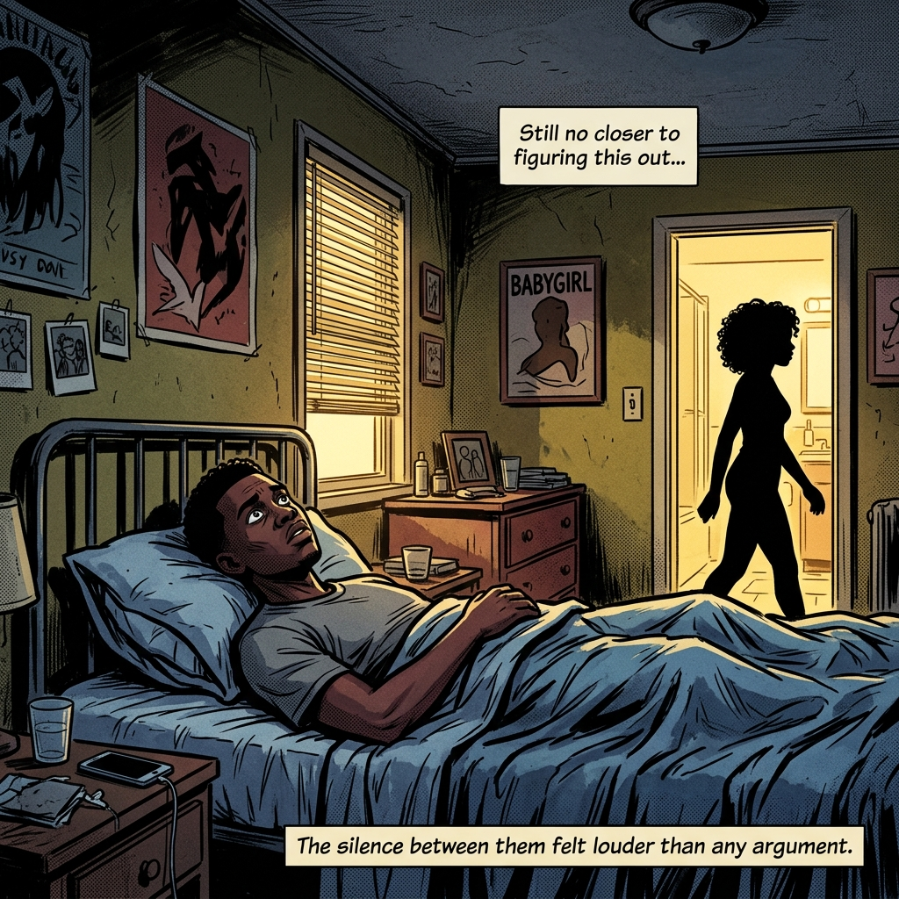

# Episode 1: The Exchange

## Scene 1: The West Side

**Tuesday — L.A. West Side — 6:15 PM**

The hue of the L.A. skyline had the street smothered in a strange orange thick glow. Street lights began giving their light, except for those that had been shot out by gang members, who seem to run these streets of L.A.

Young kids stood on corners as lookouts, apartment buildings casting their shadows along the concrete and green grass of the yards, crackheads driving walking running trying to find their next hit. Older men and women sat watching, just watching, staying clear of stray bullets.

Not many kids played on these streets, parents didn't trust the lives of their children on these streets but with the way money was, honest money there was nowhere else to go now.

The sounds of video games sliced through the smog filled air along with the sounds of barking dogs, that were usually kept to protect a stash spot for dope or guns. The few houses on the block were kept up in spite of the infestation of gangs. Those that owned these houses did not like the element that hung out, so they just watched, worked and kept it moving hoping that things would soon get better.

---

## Scene 2: The Block

Marseles walked the block with the rhythm of someone who belonged there — alert, eyes scanning every corner, every window, every shadow. The streets called to him like they called to all of them. Money was the only language that made sense here, and he was fluent.

He moved past the lookouts, past the crackheads, past the old heads on their porches shaking their heads at another generation slipping through the cracks. The stash spot was close. He could feel it.

---

## Scene 3: The Chase

Shots rang out — one, two, then a dozen. The kind of gunfire that turned a quiet block into a war zone in seconds. Marseles didn't think. He just moved.

Glass shattered somewhere behind him. A bullet grazed a mailbox — sparks flew as fast as the bullet itself. He ducked behind a car, then bounced up and kept running. The shots faded as quickly as they came.

More shots were fired. Marseles ran passing between houses, making a left onto the next street. A quick look up and down the block — he dashed across the street into the back yard of an abandoned house that doesn't look abandoned. Climbing into the window, he fell against the wall, listening to his heart slam against the inside of his chest, trying to rush air into his lungs.

---

## Scene 4: Safe House

"What happened to you? I thought one time got you the way you was just stuck out there," L.G said.

"SSSSSSSH," Marseles whispered, still catching his breath.

L.G stood in the doorway, eyes still wet, laughing — watching his boy get checked by a girl. But he knew it was the love, because his boy was no push over for a woman.

"Put some drawls on my boy," L.G said, grinning. "Mind ya business. This my house."

Slapping Babygirl across her ass as she walked by. Both him and L.G had to watch.

---

## Scene 5: Morning After

Marseles lay in bed, staring at the ceiling. The events of the night before still racing through his mind. Babygirl walked in, looking at him with that neck break like only a Black woman could.

"You know you're so smart you're stupid sometimes," she said.

Marseles had heard that more than just a few times.

"I'm going to get it baby, don't trip," he said.

"Yea you're going to get it, but you may not get it the way you want it," she said, rolling out of bed to get ready for work.

"Why don't you let me take care of you," Babygirl said from the bathroom.

"You are taking care of me," he said, watching her silhouette in the bathroom.

"Not this morning I've got — " she paused as she peeked out the bathroom, seeing that look in his eyes. "— to go. You're not dying so I've got to go to work. Your crack don't pay my bills."

Marseles watched her go.

---

*End of Episode 1*
